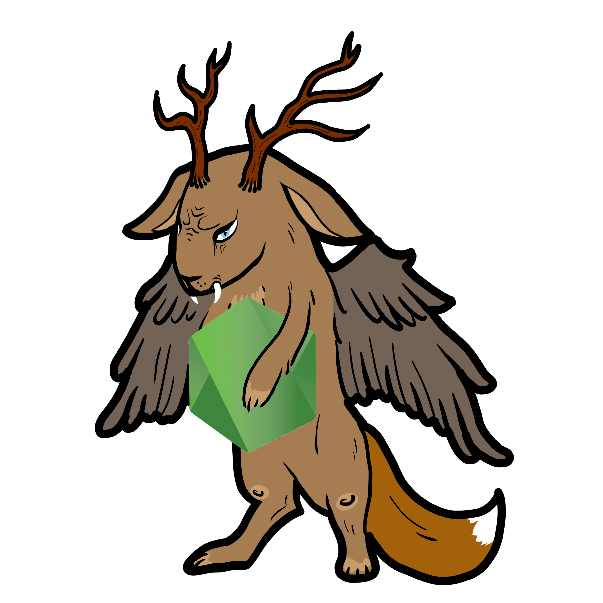

#  Wolpertinger
### Microservice to order custom shirts :shirt:

### Apache server
[:link:](apache) Static http server with the images for the backend and frontend.

### Node.js backend
[:link:](backend) Loads images from the apache server and creates entities based on folder structure.

### Vue.js frontend
[:link:](frontend) Website for a shop where you can create a unique t-shirt.